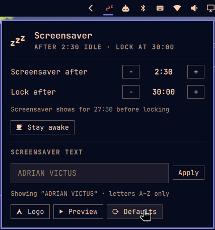

# Screensaver (Omarchy bar widget)

Shows when the screensaver starts and when the screen locks, and lets you
change both from the bar.

  
  

- **Left click**: popup with −/+ for "Screensaver after" and "Lock after",
  Preview, Stay awake, and Defaults (2:30 / 5:00).
- **Screensaver text**: type a word and press Enter (or Apply) to show it on
  the screensaver instead of the logo, in the same lettering as the Omarchy
  logo. **Logo** puts the stock logo back.
- **Right click**: toggle stay-awake (icon turns into a coffee cup).
- **Hover**: current timings.

Changes are written to `idle.screensaver` / `idle.lock` in
`~/.config/omarchy/shell.json` by `bin/set-idle` (atomic replace, nothing else
in the file is touched). The lock is never allowed before the screensaver.

## Screensaver lettering

`bin/render-word` draws text in the Omarchy logo's lettering: a narrowed cut of
the FIGlet font *Delta Corps Priest 1* (`fonts/DeltaCorpsPriest1.flf`), with
M, A, R, C, H and Y taken straight from `$OMARCHY_PATH/logo.txt`. Rendering
`omarchy` reproduces the logo exactly. Only A–Z exist in the font; other
characters are dropped. Long text is split one word per line.

`bin/set-word` writes the result to `~/.config/omarchy/branding/screensaver.txt`
(the file `omarchy branding screensaver` also edits) and remembers the word in
`~/.local/state/omarchy/adrian.screensaver/word`.

    bin/render-word "be right back"     # print it
    bin/set-word "be right back"        # use it
    bin/set-word --reset                # back to the logo

## Install

    ln -sfn ~/Work/screensaver ~/.config/omarchy/plugins/adrian.screensaver
    omarchy-shell shell rescanPlugins
    omarchy plugin enable adrian.screensaver

Edits here aren't reliably picked up by the hot-reload watcher (it doesn't
follow the symlink, and `rescanPlugins` can keep a cached copy); run
`omarchy restart shell` after saving.

## Credits

`fonts/DeltaCorpsPriest1.flf` is the FIGlet font *Delta Corps Priest 1* by
CoSMiC cHiLD, from the [xero/figlet-fonts](https://github.com/xero/figlet-fonts)
collection. The Omarchy logo lettering comes from [Omarchy](https://omarchy.org/).

## License

MIT — see [LICENSE](LICENSE). This covers the plugin's own code; the bundled
font stays under its author's terms.
